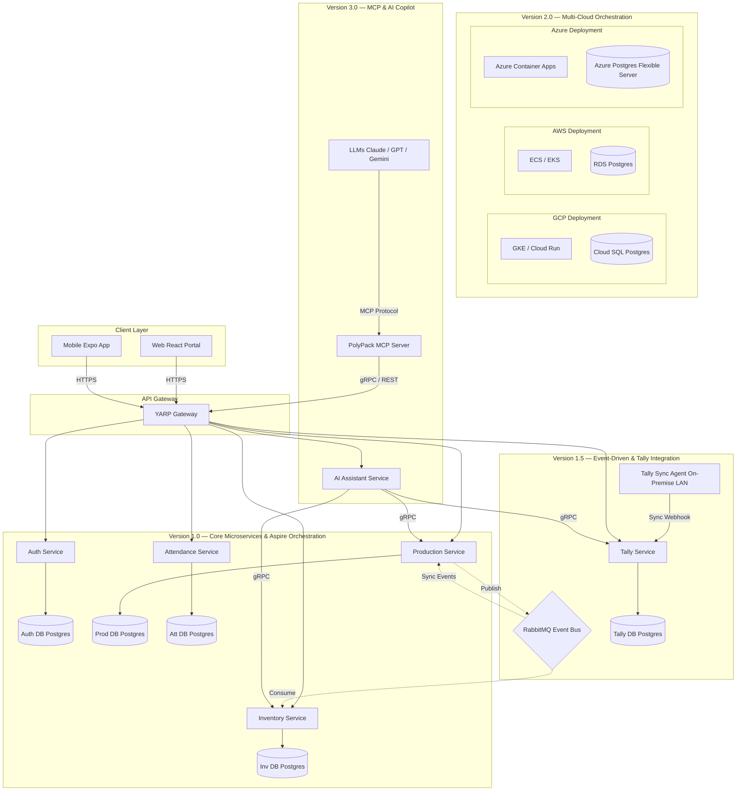

# 🏭 PolyPack Manufacturing ERP — Phased Migration Roadmap

This document serves as the step-by-step engineering roadmap to transition the PolyPack Manufacturing ERP from its Google Sheets prototype into a cloud-native microservices architecture using **.NET 10**.

---

## 🗺️ Multi-Version Architecture Diagram

The system is designed to evolve in versions, beginning with a local developer orchestration shell (.NET Aspire) and scaling up to multi-cloud deployment and AI integrations via Model Context Protocol (MCP).

---

## 🚀 Version Breakdown & Step-by-Step Implementation

We will execute the migration in four versions. Each step corresponds to a functional milestone with a designated Git commit.

---

### 📦 Version 1.0: Local Core Microservices (Foundations)
*Focus: Setting up the mono-repo, .NET Aspire local orchestration, YARP Gateway, and the core data schemas in PostgreSQL.*

#### Step 1.1: Project Directory Structure & .NET Aspire Initialization
*   **Goal**: Initialize a multi-project solution structure using `.NET Aspire` to coordinate service discovery, databases, and local dashboards.
*   **Actions**:
    *   Create directories: `/src`, `/src/Gateways`, `/src/Services`, `/src/Shared`.
    *   Create .NET Aspire projects: `PolyPack.AppHost` (orchestrator) and `PolyPack.ServiceDefaults` (shared telemetry, diagnostics, and health check configs).
    *   Set up Docker Compose or Aspire integration for local PostgreSQL database containers.
*   **Git Commit**: `feat(aspire): initialize .net aspire apphost and service defaults orchestration shell`

#### Step 1.2: Identity Microservice (`Services.Auth`)
*   **Goal**: Establish role-based access control (RBAC) and PIN validation.
*   **Actions**:
    *   Create ASP.NET Core 10 Web API project `PolyPack.Services.Auth`.
    *   Configure Entity Framework Core with PostgreSQL.
    *   Implement user authentication model: PIN hashing using SHA-256 for rapid operator login, alongside full username/password credentials.
    *   Enable JWT token generation and validation.
*   **Git Commit**: `feat(auth): implement identity microservice with sha-256 pin-based jwt authentication`

#### Step 1.3: Production Microservice (`Services.Production`)
*   **Goal**: Manage logging for Extrusion and Cutting operations.
*   **Actions**:
    *   Create `PolyPack.Services.Production` Web API project.
    *   Add schemas for `ExtrusionLog`, `CuttingLog`, and `MachineMaster`.
    *   Expose endpoints: `POST /api/production/extrusion` and `POST /api/production/cutting`.
    *   Create machine status registry endpoint (`GET /api/production/machines`).
*   **Git Commit**: `feat(production): add production logging microservice with extrusion and cutting domains`

#### Step 1.4: Inventory Microservice (`Services.Inventory`)
*   **Goal**: Manage material balances and low-stock limits.
*   **Actions**:
    *   Create `PolyPack.Services.Inventory` Web API project.
    *   Design schema for `MaterialStockMaster` and `GoodsReceiptNote` (GRN).
    *   Expose endpoints for manual stock updates, GRN receipting, and fetching stock levels.
*   **Git Commit**: `feat(inventory): implement stock tracking and manual grn entry microservice`

#### Step 1.5: HR & Attendance Microservice (`Services.Attendance`)
*   **Goal**: Allow operators to register shifts and attendance.
*   **Actions**:
    *   Create `PolyPack.Services.Attendance` Web API project.
    *   Add schema for `AttendanceRecord` (Employee, Shift, Role, Machine, In-Time, Out-Time).
    *   Implement clock-in/clock-out log endpoints.
*   **Git Commit**: `feat(attendance): add employee shift and attendance tracking service`

#### Step 1.6: YARP API Gateway (`Gateways.ApiGateway`)
*   **Goal**: Secure and route all client calls.
*   **Actions**:
    *   Create `PolyPack.Gateways.ApiGateway` using YARP (Yet Another Reverse Proxy).
    *   Configure routing rules to map `/api/auth/*` -> Auth Service, `/api/production/*` -> Production, etc.
    *   Add JWT bearer authorization policy at the gateway level.
*   **Git Commit**: `feat(gateway): configure yarp gateway routing, jwt validation and rate-limiting`

#### Step 1.7: E2E Integration & Verification
*   **Goal**: Orchestrate and verify the entire system running locally.
*   **Actions**:
    *   Bind all microservices and Postgres containers in `PolyPack.AppHost`.
    *   Launch the .NET Aspire dashboard. Validate service discovery and HTTP requests between the YARP gateway and backend APIs.
*   **Git Commit**: `test(e2e): configure local end-to-end integration and verified gateway routes`

---

### 🔄 Version 1.5: Asynchronous Workflows & Tally Integration
*Focus: Event-driven communication for stock deductions, and syncing ERP data from local networks.*

#### Step 2.1: RabbitMQ & MassTransit Integration
*   **Goal**: Implement async stock deductions when extrusion occurs.
*   **Actions**:
    *   Add RabbitMQ resource to `PolyPack.AppHost`.
    *   Integrate `MassTransit.AspNetCore` in the Production and Inventory services.
    *   Define `ExtrusionLoggedEvent` message contracts.
    *   Implement `ExtrusionLoggedConsumer` in the Inventory service to automatically deduct stocks upon receiving messages.
*   **Git Commit**: `feat(events): integrate rabbitmq event bus for automatic stock deductions via masstransit`

#### Step 2.2: Tally Integration Service (`Services.Tally`)
*   **Goal**: Host cache database for orders, stock summaries, and sync settings in the cloud.
*   **Actions**:
    *   Create `PolyPack.Services.Tally` Web API project.
    *   Design DB models for `TallySalesOrder`, `TallyPurchaseOrder`, and `TallyConnectionSettings`.
    *   Expose endpoints for webhook ingestion from the Local Sync Agent.
*   **Git Commit**: `feat(tally-sync): add tally cloud service to cache sales orders and purchase orders`

#### Step 2.3: Local Tally Sync Agent (On-Premises Worker)
*   **Goal**: Pull data from local XML systems and upload it to the cloud.
*   **Actions**:
    *   Create `PolyPack.TallySyncAgent` as a lightweight .NET 10 Worker Service.
    *   Write the HTTP XML parser to query Tally XML Gateways (default: `localhost:9000`).
    *   Set up a cron timer (using Hosted Services) to extract XML orders, transform them into JSON models, and securely POST them to the cloud gateway using a secure API Key.
*   **Git Commit**: `feat(tally-agent): build local dot net worker service agent for xml-to-json tally sync`

---

### ☁️ Version 2.0: Multi-Cloud Deployment Configuration (AWS, GCP, Azure)
*Focus: Provisioning infrastructure and deploying containers seamlessly across major cloud providers using .NET Aspire configurations.*

#### Step 3.1: Containerization & Dockerfile Setup
*   **Goal**: Containerize all microservices for cloud orchestration.
*   **Actions**:
    *   Write multi-stage `Dockerfiles` optimizing for **.NET 10 AOT compilation** where applicable.
    *   Create environment configurations for dev, staging, and production.
*   **Git Commit**: `ops(docker): configure optimized multi-stage dockerfiles for dotnet 10 microservices`

#### Step 3.2: GCP Deployment (Google Cloud Platform)
*   **Goal**: Deploy services to Google Cloud Run and Cloud SQL (PostgreSQL).
*   **Actions**:
    *   Generate Kubernetes manifests or Cloud Run service configurations.
    *   Configure GCP Cloud SQL (Postgres) databases.
    *   Set up Google Cloud Build pipelines for continuous integration.
*   **Git Commit**: `ops(gcp): configure google cloud run, cloud sql, and cloud build deploy pipelines`

#### Step 3.3: AWS Deployment (Amazon Web Services)
*   **Goal**: Deploy services to AWS ECS Fargate and Amazon RDS.
*   **Actions**:
    *   Create AWS CDK (Cloud Development Kit) scripts or Terraform files.
    *   Set up Amazon RDS for PostgreSQL.
    *   Deploy ECS Fargate tasks behind an Application Load Balancer (ALB).
*   **Git Commit**: `ops(aws): add terraform/cdk configurations for aws ecs fargate and rds postgres`

#### Step 3.4: Azure Deployment (Microsoft Azure)
*   **Goal**: Deploy services to Azure Container Apps (ACA) using .NET Aspire deployment engines.
*   **Actions**:
    *   Use `.NET Aspire AZD (Azure Developer CLI)` integration (`azd init` / `azd deploy`).
    *   Deploy to Azure Container Apps environments and Azure Database for PostgreSQL (Flexible Server).
    *   Configure Azure Service Bus as the production-grade message broker.
*   **Git Commit**: `ops(azure): implement azd deploy manifest for azure container apps and service bus`

---

### 🤖 Version 3.0: Model Context Protocol (MCP) & AI Integration
*Focus: Exposing PolyPack data to LLMs via an MCP Server, and powering the voice/chat assistant.*

#### Step 4.1: AI Assistant Microservice (`Services.AI`)
*   **Goal**: Orchestrate natural language inputs using generative models.
*   **Actions**:
    *   Create `PolyPack.Services.AI` Web API project.
    *   Implement standard OpenRouter/Anthropic clients.
    *   Configure gRPC endpoints in Auth, Production, Inventory, and Tally services to enable high-speed read queries from the AI service.
*   **Git Commit**: `feat(ai): add ai assistant service with grpc federated data collection`

#### Step 4.2: PolyPack MCP Server (`PolyPack.MCPServer`)
*   **Goal**: Expose factory operations as tools to LLM interfaces via Model Context Protocol.
*   **Actions**:
    *   Create a dedicated console application implementing the MCP protocol (over stdio/SSE).
    *   Implement tools: `get_current_stock_levels`, `log_extrusion_log`, `get_active_machines`, `get_pending_orders`.
    *   Implement resource resolvers allowing LLMs to read real-time logs.
*   **Git Commit**: `feat(mcp): implement polypack model context protocol mcp server for llm tooling`

#### Step 4.3: MCP Integration and Agent Playgrounds
*   **Goal**: Integrate the PolyPack MCP server with Antigravity, Claude Desktop, and Cursor.
*   **Actions**:
    *   Write configurations (`mcp_config.json` for Claude Desktop).
    *   Test natural language execution: *"Ask PolyPack to check if we have enough HDPE stock for the Cipla order, and log 120kg extrusion if we do."*
*   **Git Commit**: `feat(mcp): configure and test client integrations in mcp_config.json`

---

## 📈 Git Commit & Implementation Progress Tracker

Use this table as a check-list to verify Git commits during development.

| Step | Milestone Description | Target Git Commit Message | Status |
|---|---|---|---|
| **1.1** | Project Directory & Aspire setup | `feat(aspire): initialize .net aspire apphost and service defaults orchestration shell` | ⬜ Pending |
| **1.2** | Identity Service | `feat(auth): implement identity microservice with sha-256 pin-based jwt authentication` | ⬜ Pending |
| **1.3** | Production Service | `feat(production): add production logging microservice with extrusion and cutting domains` | ⬜ Pending |
| **1.4** | Inventory Service | `feat(inventory): implement stock tracking and manual grn entry microservice` | ⬜ Pending |
| **1.5** | Attendance Service | `feat(attendance): add employee shift and attendance tracking service` | ⬜ Pending |
| **1.6** | YARP Gateway | `feat(gateway): configure yarp gateway routing, jwt validation and rate-limiting` | ⬜ Pending |
| **1.7** | Integration & Verification | `test(e2e): configure local end-to-end integration and verified gateway routes` | ⬜ Pending |
| **2.1** | RabbitMQ Messaging | `feat(events): integrate rabbitmq event bus for automatic stock deductions via masstransit` | ⬜ Pending |
| **2.2** | Tally Sync Endpoints | `feat(tally-sync): add tally cloud service to cache sales orders and purchase orders` | ⬜ Pending |
| **2.3** | Local Tally Agent | `feat(tally-agent): build local dot net worker service agent for xml-to-json tally sync` | ⬜ Pending |
| **3.1** | Docker Configurations | `ops(docker): configure optimized multi-stage dockerfiles for dotnet 10 microservices` | ⬜ Pending |
| **3.2** | GCP Configurations | `ops(gcp): configure google cloud run, cloud sql, and cloud build deploy pipelines` | ⬜ Pending |
| **3.3** | AWS Configurations | `ops(aws): add terraform/cdk configurations for aws ecs fargate and rds postgres` | ⬜ Pending |
| **3.4** | Azure Deploy Manifests | `ops(azure): implement azd deploy manifest for azure container apps and service bus` | ⬜ Pending |
| **4.1** | AI Service & gRPC | `feat(ai): add ai assistant service with grpc federated data collection` | ⬜ Pending |
| **4.2** | MCP Server | `feat(mcp): implement polypack model context protocol mcp server for llm tooling` | ⬜ Pending |
| **4.3** | MCP Testing & Config | `feat(mcp): configure and test client integrations in mcp_config.json` | ⬜ Pending |
